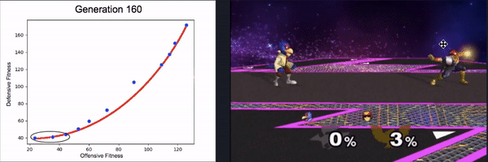
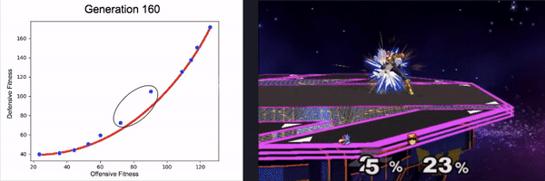
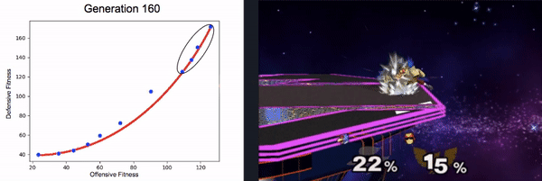

# Melee Fighting AI
In recent years, massive improvements
have been made surrounding gameplaying
artificial intelligence. Simple
board games to complex multiplayer
battle games have been
solved with reinforcement learning approaches.
Although reinforcement
learning has become the most popular
method for solving these tasks, approaches
that make use of neuroevolution
have still shown promising results.
In this work, we investigate the performance
of evolutionary algorithms on
the popular console fighting game Super
Smash Bros. Melee (SSBM).

Our agents were trained with two different objectives in mind——offense and defense. We measure these two objectives in terms of damage. The more damage an agent deals, the more offensive it is. Likewise, agents that receive less damage are more defensive. By making use of DEAP's non-dominated sorting genetic algorithm (NSGA-II), we can optimize both of these objectives to evolve a diverse set of agents that implement varying degrees of offensive and defensive strategies. A few of these strategies can be seen below:

Our agent is Captain Falcon and his opponent is a level 9 Falco cpu.
 Our most defensive agents do not exhibit complex defensive strategies like running away and shielding. Instead, the strategy consists of rolling behind the opponent and approaching with a safe attacking option. This results in a fighting style that both deals and receives a low amount of damage.
 As the agents get more offensive, they choose options that deal more damage but put them at risk for receiving more damage. This strategy combines the safe attacking options seen in our defensive agents, along with the riskier close ranged jabs of our most offensive agents.
 Our most offensive agents opt for grabs and close ranged jabs. While this strategy is most likely to deal lots of damage, the agent is also prone to receiving high amounts of damage as well.

## Requirements
Tested on: Ubuntu 14.04 LTS & macOS Sierra

1. [Download Current stable version of Dolphin for Ubuntu](https://wiki.dolphin-emu.org/index.php?title=Building_Dolphin_on_Linux#14.04_LTS) or [Dolphin 5.0 for macOS](https://dolphin-emu.org/download/).
2. Super Smash Bros. Melee (NTSC 1.02) iso
3. Python 3
4. Python packages: [DEAP](https://github.com/DEAP/deap#installation), numpy

## Set-up
Before running, set up a pipe in Dolphin to control your agents: https://github.com/luckycharms14/MeleeAI_Dolphin. Turn cheats on, and make sure netplay community settings are on.

## Run
Pull the repo and run with `python3 -m p3` before opening Dolphin. Stop with ^C.

## Report
My final report over this project can be found [here](https://github.com/FRI-GAMEAI/NSGA-Smash-AI/blob/master/final%20report.pdf)

## Credits
Thanks to https://github.com/spxtr/p3 for the memory watcher, as well as to https://github.com/luckycharms14/MeleeAI_Dolphin for help with setting up Dolphin pipe configuration. Inspiration for this project comes from https://github.com/vladfi1/phillip
